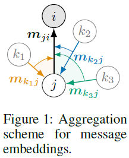
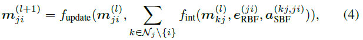

Molecule의 shape 중 Distance, Angle, Torsion 정보를 모두 활용하는 SphereNet에 대해서 리뷰하겠습니다.

# 3줄 요약
1. molecule의 distance, angle, torsion 정보를 모두 활용
2. 
3. Spherical Coordinate System (SCS)에 적합한 Spherical Message Passing (SMP) 정의
 

# Abstract
- 현재 3D의 공간적인 위치를 고려한 priciple한 GN 프레임워크가 부족하다.
- node들의 상대적인 위치가 SMS에서 unique하게 존재하고, SMP를 통하여 완전하고 정확한 3D Graph의 구조를 representation을 학습할 수 있다. 
- 기존의 3D model들은 모두 SphereNet의 한 종류들이라고 볼 수 있다.

 

 # Introduction
 - 본 연구에서는 3D Grpah의 일반적인 framework로 3DGN (3D Graph Network)을 제안한다. 
 - 3DGN은 researcher들이 쉽게 3D Graph의 최신 method를 쉽게 개발할 수 있도록 다양한 수준의  세분화된 graph에서 명확한 인터페이스를 제공하는 것을 목표로 한다.
 - 원래의 3D Graph에서 Cartesian coordinate (데카르트 좌표)는 computational model에 대한 직접 입력으로 사용할 수 없다.
 - 모델의 성능을 손상시킬 수 있는 심각한 중복 정보가 포함되어 있기 때문
 - 또한 input graph의 translation과 rotation에 invariant 하지 않다.
 - 따라서 message passing neural network (MPNN)에 이어 3DGCN framework를 구현하기 위해 spherical message passing (SMP)으로 알려진 최신 message passing scheme을 제안한다.
 - spherical coordinate system (SCS)에서의 분석을 바탕으로, 3D graph의 각 node의 상대적인 위치가 SMP scheme에서 unique하게 결정된다는 것을 보여준다.
 - 제안하는 SMP는 SCS에서 3DGN을 구현하기 위한 완전하고 정확한 architecture를 표현한다.
 - encoding된 3D 정보는 pairwise node간의 거리와 같은 상대적인 위치 정보이므로, SMP는 input graph의 translation과 rotation에 invariant한 prediction을 한다.
 - 기존의 SchNet, DimeNet 등은 부분적인 3D 정보만 활용하기 때문에 모두 SphereNet의 한 종류이다.
  
 

# Related Work
## Graph Neural Networks
- 

 

# Directional Message Passing
## Graph neural networks
GCN, GAT, GIN과 같은 일반적인 GNN은 3D positional info를 활용하지 않는다.

 

## Methods for 3D Graphs
$h_{i}$를 중심으로 살펴보자. $h_{i}$는 $m_{ji}$을 통해 update된다. 

 

$m_{ji}$은 $n_{j}$와 $n_{i}$ 사이의 distance와 $m_{kj}$를 통해 update되는데 그 과정에서 $n_{k}$, $n_{j}$, $n_{i}$의 angle도 함께 aggregate된다.

 
