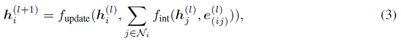

Molecule의 shape 중 Distance, Angle, Torsion 정보를 모두 활용하는 SphereNet에 대해서 리뷰하겠습니다.

# 3줄 요약
1. molecule의 distance, angle, torsion 정보를 모두 활용
2. 
3. Spherical Coordinate System (SCS)에 적합한 Spherical Message Passing (SMP) 정의
 

# Abstract
- 저자는 현재 3D의 공간적인 위치를 고려한 priciple한 GN 프레임워크가 부족하다고 지적한다.
- node들의 상대적인 위치가 SMS에서 unique하게 존재하고, SMP를 통하여 완전하고 정확한 3D Graph의 구조를 representation을 학습할 수 있다고 한다. 
- 기존의 3D model들은 모두 SphereNet의 한 종류들이라고 주장한다.

 

 # Requirements for Molecular Predictions
 최근 potential energy, HOMO energy와 같은 low-level의 양자역학적 특성,  high-level의 toxity, 약물 부작용 과 같은 다양한 molecule 특성을 예측하는 연구가 많이 이루어졌다. 본 연구에서는 scalar regression target에 초점을 맞출 것이다. molecule은 atomic number와 position에 따라 unique하게 정의된다. 일부 모델은 bond type이나 electronegativity와 같은 auxiliary 정보를 추가로 사용하지만 이러한 정보들은 hand-engineered 되고 필수적이지 않기 때문에 포함하지 않는다.

 

# Directional Message Passing
## Graph neural networks

일반적인 GNN은 이웃 node와 edge 정보, 그리고 자신의 정보를 바탕으로 update된다.

 

## Message embeddings
$h_{i}$를 중심으로 살펴보자. $h_{i}$는 $m_{ji}$을 통해 update된다. 

 

$m_{ji}$은 $n_{j}$와 $n_{i}$ 사이의 distance와 $m_{kj}$를 통해 update되는데 그 과정에서 $n_{k}$, $n_{j}$, $n_{i}$의 angle도 함께 aggregate된다.

 
