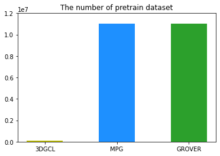

# Abstract
새로운 3D contrastive 방법으로 학습을 하니 supervised 보다 성능이 좋아졌다.
pretrain data도 자기꺼만 사용하니 많이 필요없고 모델도 무겁지 않다.
 

최근 molecule 분야에 self-supervised 방법이 널리 사용되고 있다. label이 없는 데이터를 활용하여 data 자체의 supervision을 통해 데이터의 representation을 학습하는 방법.
 

# 기존 방법의 문제점
1. SSL시 molecule의 구조를 변경함. 분자는 이미지와 달리 단순 변환이라도 완전히 다른 특성을 초래할 수 있음.
2. 매우 많은 pretrain 데이터 사용
3. 매우 많은 모델 파라미터 사용
4. 3D 구조를 반영하지 못함
 

# Novelty
1. molecule의 성질을 유지시키면서 contrastive learning 하는 새로운 방법 (conformer, rotation, noise)
2. pretrain data로 1128개만 사용
3. 적은 파라미터 사용 (< 1 million, qm8 기준 2시간 30분 소요)
4. 3D 구조 활용

 

# Result
 

- supervised 보다 pretrain 했을 경우 성능이 뛰어남. 우리의 방법이 3D 분자 표현을 학습하는데에 적합한 방법임.
- dataset으로 small molecule (<20) + low level (Regression) 4가지 dataset 사용

 

|Dataset  |ESOL   |Freesolv| QM7   | QM8    |Pretrain| Params | Improvement |
|---      |---    |---     | ---   | ---    | ---    | ---    |--- |
|No GROVER| 0.911 | 1.987  | 89.408| 0.017  | ---    | ---    |--- |
|GROVER   | 0.831 | 1.544  | 72.5  |**0.0125**| 11 MM  |100 MM  | 15.55 / 19.15  |
|No MPG   | 0.896 | 1.967  | ---   | ---    | ---    | ---    |--- |
|MPG      |**0.741**|**1.269**|--- | ---    | 11 MM  |50 MM   | 26.75 / -- |
|No 3DGCL | 1.012 | 2.379  | 50.8  | 0.0175 | ---    | ---    |--- |
|3DGCL    | 0.745 | 1.533  |**43.4**| 0.0126| 1,128  |900k    | **31 / 26.15** |

 

 

 

|Dataset  |ESOL   |Freesolv| QM7   | QM8    |  Pretrain | 
|---      |---    |---     | ---   | ---    |     ---   |
|Molformer| ---   | ---    | 43.9  | **0.009** |  X  |
|GROVER   | 0.831 | 1.544  | 72.5  | 0.0125 | 11 millions|
|MPG      |**0.741**|**1.269**|--- | ---    | 11 millions|
|3DGCL    | 0.745 | 1.533  | **43.4**  | 0.0126 | 1,128 |

 

|Dataset  |ESOL   |Freesolv| QM7   | QM8    |  
|---      |---    |---     | ---   | ---    |
|pretrain | ESOL  | ESOL   | ESOL  | ESOL   |
|cutoff   | 5.0   | 8.0    | 8.0   | 8.0    |
|layers   | 2     | 2      | 2     | 2      | 
|filters  | 128   | 512    | 256   | 256    |
|gaussians| 50    | 50     | 100   | 100    |
|z_dim    | 512   | 256    | 128   | 128    | 
|dropout  | 0.3   | 0.1    | 0.2   | ---    | 
|optim    | Expo  | Expo   | Expo  | Expo   | 
|Super    | 1.012 | 2.379  | 50.8  | 0.0175 | 
|Pretrain | 0.745 | 1.533  | 43.4  | 0.0126 | 
|SOTA     | Yes   | Yes    | Yes   | No     | 
|Decrease | 26.4% | 35.6%  | 14.6% | 28%    | 

# 1. Introduction

# 2. Related Work

Schnet
1. **cutoff** 기반의 GNN
2. orthogonal function (**Gaussian function**)을 사용한 distance embedding
3. 3D 공간에 적합한 **continuous-filter** convolution 사용
4. dataset: QM9

DimeNet
1. **cutoff** 기반의 GNN
2. orthogonal function (**Gaussian function**)을 사용한 distance embedding
3. 3D 공간에 적합한 **continuous-filter** convolution 사용

DimeNet++
- dataset: QM9

SphereNet
- dataset: QM9

SimCLR

GraphCL
- Augmentation: Node dropping, Edge perturbation, Attribute masking, Subgraph
- Pretrain data: 456K from ChEMBL
- 

3D informax
- dataset: QM9
- 2D GNN에 3D 정보가 담기도록 pre-train

3D Transformer
- dataset: QM7, QM8, QM9
- QM9: 9/0.5/0.5

MolCLR
- dataset: QM7, QM8, QM9
- QM9: SchNet과 같게 setting (110,000/10,000/10,831)
GeomGCL: 

MolCLR: 

GROVER
- Transformer, 2D, **a very large number of parameters**
- dataset: QM7, QM8
- 8:1:1 / 3 random seeded scaffold spliting

MoCL: 

MICRO-graph: 

MolCLE: 

ChemBERTa: 

# 3. Method

# 4. Experiments

## SchNet ##
|Dataset | BBBP  |ClinTox| SIDER | BACE  | 
|  ---   |  ---  |  ---  |  ---  | ---   |
|cutoff  | 5.0   | 5.0   | 5.0   | 5.0   |
|layers  | 2     | 2     | 2     | 2     | 
|z_dim   | 512   | 512   | 512   | 512   |
|dropout | 0.2   | 0.3   | 0.2   | 0.2   | 
|optim   | Step  | Step  | Step  | Step  | 
|Super   | 0.85  | 0.671 | 0.579 | 0.797 | 
|Pretrain| 0.867 | 0.739 | 0.585 | 0.811 | 
 

|Dataset  |ESOL   |Freesolv| QM7   | QM8    |Lipo   |
|---      |---    |---     | ---   | ---    |---    |
|pretrain | ESOL  | ESOL   | ESOL  | ESOL   | ESOL  |
|cutoff   | 5.0   | 8.0    | 8.0   | 8.0    | 5.0   |
|layers   | 2     | 2      | 2     | 2      | 2     | 
|filters  | 128   | 512    | 256   | 256    | 128   |
|gaussians| 50    | 50     | 100   | 100    | 50    |
|z_dim    | 512   | 256    | 128   | 128    | 512   |
|dropout  | 0.3   | 0.1    | 0.2   | ---    | 0.0   |
|optim    | Expo  | Expo   | Expo  | Expo   | Expo  |
|Super    | 1.012 | 2.379  | 50.8  | 0.0175 | 0.961 |
|Pretrain | 0.745 | 1.533  | 43.4  | 0.0126 | 0.723 |
|SOTA     | Yes   | Yes    | Yes   | No     | No    |
|Decrease | 0.736%| 0.644% | 0.854%| 0.72%  | No    |
 

cutoff = 5 > 8 > 3 > 10
gaussian = 200 > 50 > 400
filter = 512 > 256 > 128
z_dim = 256 > 128 > 512
lr = 5e-3 > 1e-3, 1e-4 > 3e-3 > 1e-5
weight_decay = 1e-8 > 1e-6  ??

|Dataset  |E1-CC2 |E2-CC2 |f1-CC2 | f2-CC2|E1-PBE0|E2-PBE0|f1-PBE0|f2-PBE0|E1-CAM |E2-CAM |f1-CAM |f2-CAM |
|---      |---    |---    | ---   | ---   | ---   | ---   |---    | ---   | ---   | ---   | ---   |---   |
|pretrain | ESOL  | ESOL  | ESOL  | ESOL  | ESOL  |ESOL   | ESOL  | ESOL  | ---   |ESOL   | ---   |ESOL   | 
|cutoff   | 8.0   | 8.0   | 8.0   | 8.0   | 8.0   | 8.0   | 8.0   | 8.0   | 8.0   | 8.0   | 8.0   | 8.0   | 
|layers   | 2     | 2     | 2     | 2     | 2     | 2     | 2     | 2     | 2     | 2     | 2     | 2     | 
|filters  | 256   | 256   | 512   | 512   | 512   | 512   | 512   | 512   | 512   | 512   | 512   | 256   |
|gaussians| 100   | 100   | 100   | 100   | 100   | 100   | 100   | 100   | 100   | 100   | 100   | 100   |
|z_dim    | 128   | 128   | 128   | 128   | 128   | 128   | 128   | 128   | 128   | 128   | 128   | 128   | 
|f_dropout| 0.0   | 0.1   | 0.0   | 0.1   | 0.0   | 0.0   | 0.1   | 0.2   | 0.0   | 0.0   | 0.0   | 0.2   |
|optim    | Expo  | Expo  | Expo  | Expo  | Expo  | Expo  | Expo  | Expo  | Expo   |Expo  | Expo  |Expo   | 
|Super    |0.00783|0.00881|0.02077|0.03671|0.00776|0.00856|0.01688|0.03191|0.00695|0.00809|0.01996|0.03609|
|Pretrain |0.00643|0.0074 |0.01203|0.02957|0.00642|0.00722|0.00991|0.02295|0.0058 |0.00683|0.01065|0.02609|
 

|Dataset | BBBP  | SIDER | BACE  |
|  ---   |  ---  |  ---  |  ---  |
|cutoff  | 8.0   | 8.0   | 10.0  |
|layers  | 3     | 3     | 2     |
|z_dim   | 512   | 256   | 512   | 
|dropout | 0.0   | 0.0   | 0.2   |
|optim   | Step  | Step  | Step  |
|Super   | 0.898 | 0.608 | 0.855 |
|Pretrain| 0.915 | 0.572 | 0.842 |
 

## SphereNet ##
|Dataset|ESOL|Freesolv| QM9 |
|---|---|---| --- |
|cutoff  | 8.0   | 8.0   | --- |
|layers  | 2     | 2     | --- |
|z_dim   | 128   | 128   | --- |
|dropout | 0.0   | 0.2   | --- |
|fold    | 3     | 3     | 3 |
|optim   | Expo  | Expo  | --- |
|Super   | 0.969 | 1.643 | --- |
|Pretrain| 0.84  | 1.352 | --- |
 

## BBBP
|Augmentation|ETKDG|Rotation|Noise|Atom Dropping|Attribute Masking|
|---|---|---|---|---|---|
|ETKDG             | 0.867 | 0.867 | 0.867 | 0.867 |
|Rotation          | 0.867 | 0.867 | 0.867 | 0.867 |
|Noise             | 0.867 | 0.867 | 0.867 | 0.867 |
|Atom Dropping     | 0.867 | 0.867 | 0.867 | 0.867 |
|Attribute Masking | 0.867 | 0.867 | 0.867 | 0.867 |

# 5. Conclusion

# Reference
SimCLR

# 3줄 요약
1. **Schnet** 기반의 encoder
2. orthogonal function (**Gaussian function**)을 사용한 distance embedding
3. 3D GNN에 적합한 **contrastive learning** 방법 제시

 
