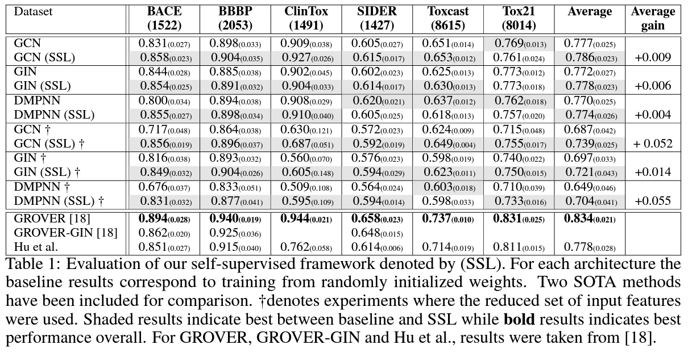

# 3줄 요약
1. Pretext task를 atom level, fragment level, molecule level의 task로 구성
2. Pretrain dataset을 250k만을 사용
3. input feature의 크기와 self-supervision 효과 간의 연관성 분석
 

# Method
- ADME와 같은 molecule의 특성들은 graph-level의 관점에서 살펴봐야 하지만 현재 대부분의 SSL 모델들은 node-level에 집중하고 있다.
- node로 부터 graph의 representation이 얻어지기 때문에 node-level의 pre-training 또한 중요하다.
- toxicity와 같은 molecular property들은 특정 functional group의 유무와 관계되어 있는 경우가 많다. 따라서 fragment-level의 학습이 매우 중요하다.
- 따라서 본 연구에서는 atom, fragment, molecule level의 pretext task를 제안한다.

 

## Atom level
- useful한 pretext task는 1. label을 쉽게 생성할 수 있어야하고, 2. atom context에 관해 useful한 feature representation을 학습해야한다.
- atom pretext task를 각 atom이 속하는 fragment를 recognize하는 classification 문제
- fragment는 PubChem의 1 million molecule에 존재하는 fragment를 빈도 수에 따라 2000 class로 구성

## Fragment level
- molecule을 fragment로 decompose 후, fragment들이 같은 molecule에 속하는지 학습
- binary classification

## Molecule level
- molecule들이 어떤 fragments를 포함하고 있는지 학습
- multilabel classification

# Experiments
- 2개의 SOTA와 비교 실험하였다.
- 특이한 건 GROVER를 뛰어넘지는 못하는 결과로 연구를 발표했다는 점이다.

- 다음과 같은 강점이 있어서 논문을 발표한 것 같다.
1. 새로운 pretext task를 제시한점 (fragment 중심의 3가지 task)
2. 성능 향상이 architecture에 있는 것이 아니라 SSL 방법에 있는 점 (vs GROVER)
3. 250k의 pretrain dataset만 사용한 점 ( vs 11 millions (GROVER), 2 millions (Hu))
4. input feature의 size와 pretrain의 효과 간의 연관성을 (최초로) 분석한 점
5. pre-processing 과정이 필요하지 않은 점 (vs GROVER), auxiliary GNN을 사용하지 않음 점 (vs Hu)