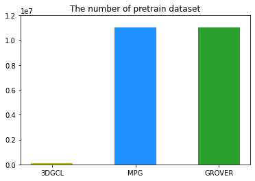
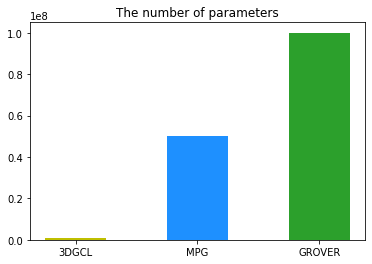

<!-- "3D Graph Contrastive Learning for Molecular Property Prediction" -->
<!-- "Small-scale 3D Graph Contrastive Learning for Molecular Property Prediction" -->
# Abstract

 
 

 

# Experiments
- 3 scaffold + 3 times
- dropout 0.0, 0.3만 비교할 것

## Freesolv
- Freesolv는  pretrain epoch, dropout 찜찜함..
- finetune의 dropout과 pretrain epoch 줄이는 것이 비슷한 효과를 나타내는 것으로 추정
### **Pretraining setup**
#### 1. pretrain의 MMFF 비교 - 1,4 > 3,4 / 1,2  **RAMDOM** **비교중**
#### 2. pretrain의 gamma 비교 - 0.99 > 0.97 > 0.95 (고정)
#### 3. pretrain의 MLP 비교 -  ReLU > SSP (고정)
#### 4. pretrain의 epoch 비교 -  39(1, 2) > 420, 432 **비교중**
#### 5. pretrain의 dropout 비교 - 0.2 > 0.0 **비교중**
MMFF, dropout, epoch 비교!!!  

### **Fine-tuning setup**
#### 1. finetune의 gamma 비교 - 0.99 > 0.97 > 0.95
#### 2. finetune의 weight decay 비교 - 1e-4 > 0 **비교중**
#### 3. finetune의 MLP 비교 -  SSP > ReLU
 

## ESOL
- ESOL은 pretrain이 best 일때 성능이 좋아보임
### **Pretraining setup**
#### 1. pretrain의 MMFF 비교 - 1,2 > 3,4 > 1,4 (고정)
#### 2. pretrain의 gamma 비교 - 0.95 > 0.97 > 0.99 (고정)
#### 3. pretrain의 MLP 비교 -  ReLU > SSP (고정)
#### 4. pretrain의 epoch 비교 -  375 > 30 > 10 (고정)
#### 5. pretrain의 dropout 비교 - 0.0 > 0.2 (고정)

### **Fine-tuning setup**
#### 1. finetune의 gamma 비교 - 0.95 > 0.97 > 0.99 (고정)
#### 2. finetune의 weight decay 비교 - 1e-6 > 5e-6 / 1e-4 = 5e-5 / 1e-3 > 1e-5
비교중 - 1e-6 vs 1e-4 vs 5e-5 vs 5e-4
#### 3. finetune의 MLP 비교 - SSP > ReLU (고정)

 

# Results
- supervised 보다 pretrain 했을 경우 성능이 향상되는 정도가 가장 뛰어남. 우리의 방법이 3D 분자 표현을 학습하는데에 적합한 방법임.
- dataset으로 small molecule (<20) + low level (Regression) 4가지 dataset 사용
 

|Dataset  |ESOL   |Freesolv| QM7   | QM8    |Pretrain| Params | Improvement |
|---      |---    |---     | ---   | ---    | ---    | ---    |--- |
|CoMPT    | 0.798 | 1.855  | ---   | ---    | ---    | ---    |--- |
|No GROVER| 0.911 | 1.987  | 89.408| 0.017  | ---    | ---    |--- |
|GROVER   | 0.831 | 1.544  | 72.5  |**0.0125**| 11 MM|100 MM| 15.55 / 19.15  |
|No MPG   | 0.896 | 1.967  | ---   | ---    | ---    | ---    |--- |
|MPG      |0.741|**1.269**|--- | ---    | 11 MM  | 50 MM  | 26.75 / -- |
|No GEM   | 0.832 | 1.857  | 59.0  | 0.0173 | ---    | ---    |--- |
|GEM      | 0.798 | 1.877  | 58.9  | 0.0171 | 20 MM  | ?? MM  | 14.1 / -0.1 / 0.02 / 1.2  |
|No 3DGCL | 0.921 | 1.704  | 51.62  | 0.0175 | ---    | ---    | --- |
|3DGCL    |**0.721**| 1.53  |**43.32**| 0.0126| 1,128  |1MM     | **31 / 26.15** |

 

 

 

|Dataset  |ESOL     |Freesolv | QM7     | QM8    |  Pretrain  |
|---      |---      |---      | ---     | ---    |     ---    |
|GROVER   | 0.831   | 1.544   | 72.5    | 0.0125 | 11 millions|
|MPG      |0.741|**1.269**|---      | ---    | 11 millions|
|GEM      |0.798    |1.877    |58.9     | 0.0171 | 20 millions|
|3DGCL    | **0.721**   | 1.608   | **43.4**| 0.0126 | 1,128      |

 

## Chirality=False
|Dataset  |ESOL   |Freesolv| QM7   | QM8    |  
|---      |---    |---     | ---   | ---    |
|epoch    |300/200|300/200 |300/100| 300/100(es30)|
|es       |---    |---     |---    | 30     |
|pretrain | ESOL  | ESOL   | ESOL  | ESOL   |
|parameter|1280257| 1358465| 368769| 368769 |
|cutoff   | 5.0   | 8.0    | 8.0   | 8.0    |
|layers   | 2     | 2      | 2     | 2      | 
|filters  | 128   | 512    | 256   | 256    |
|gaussians| 50    | 50     | 100   | 100    |
|z_dim    | 512   | 256    | 128   | 128    |
|optim    | Expo  | Expo   | Expo  | Expo   | 
|gamma    | 0.95  | 0.95   | 0.95   | ---    | 
|decay    | 0.001 | 0      | 0.0001 | ---    |
|dropout  | 0.3   | 0.0    | 0.0   | ---    |
|Super    | 0.921 | 1.72   | ---  | --- | 
|Conformer-R|**0.721**| 1.53  | **41.33**  | 0.0153 | 
|Conformer-R|0.102| 0.42  | 7.16  | --- |
|Conformer-S|0.753 | 1.687  | 43.00  | 0.0146 |
|Conformer-S|0.118| 0.492  | 11.1  | --- |
|DropN      | 0.784 | 1.703    | 44.57  | 0.0155 | 
|DropN      | 0.134| 0.38    | 15.21  | --- | 
|MaskN      | 0.773 | 2.2   | 48.75  | 0.0150 | 
|MaskN      | 0.124 | 0.86   | 11.76  | --- | 
|Noise      | 0.753 | 1.793    | 46.32 | 0.0153 | 
|Noise      | 0.092 | 0.52    | 11.74 | --- |
|SOTA       | Yes   | No    | Yes   | No     | 
|Decrease   | 26.4% | 35.6%  | 14.6% | 28%    | 

 

## Chirality=True  
|Dataset    |**ESOL** |**Freesolv**|**QM7**|BBBP| BACE  |   
|---        |---    |---      | ---     | ---   |---    |
|lr         | 0.001 | 0.001   | ---    | ---    | ---   |
|gamma      | 0.95  | 0.99    | 0.95   | ---    | ---   |
|decay      | 0.001 | 0.0001  | 0.0001 | ---    |---    |
|dropout    | 0.4   | 0.0     | 0.0    | ---    |---    |
|Super      |1.031(0.1)|1.91(0.42)| 59.70(22.1) | 71.19(0.03) | 0.762(0.02) |
|Conformer-R|0.778  |1.441     | 42.53 | 79.15   | 85.52 |
|Conformer-R|0.102  | 0.19     | 7.69  | 0.04    | 0.03  |
|Conformer-S|0.787  | 1.743    | 48.73 | 75.82   | 84.81    |
|DropN      | 0.808 | 1.743    |  57.14| 71.68   | 84.61   |
|MaskN      | 0.800 | 1.817    | 48.75 | 75.17   | 85.34 |
|Noise      | 0.780 | 1.89     | 51.34 | 77.53   | 84.4   |

 
model:enc_best_epoch-273_loss-12.051.pkl_batch-400_proj-spherenet_cutoff-5.0_layers-2_filter-128_gau-50_z_dim-512_lr-0.001_aug_1-MMFFrandom_aug_2-MMFFrandom_aug_ratio-0.25_tau-0.2_optim-ExponentialLR_weight_decay-0_expo_gamma-0.95_dropout-0.0_finetune:True_n_times:3_folds:3_target:y_loss:0.72059_sd:0.10176_batch:32_cutoff:5.0_layer:2_filter:128_gau:50_z_dim:512_dropout:0.3_lr:0.001_weight_decay:0.001_expo_gamma:0.95

model:enc_best_epoch-268_loss-11.971.pkl_pretrain-esol_batch-400_proj-spherenet_cutoff-8.0_layers-2_filter-512_gau-50_z_dim-256_lr-0.001_aug_1-MMFFrandom_aug_2-MMFFrandom_aug_ratio-0.2_tau-0.5_optim-ExponentialLR_weight_decay-0.0001_expo_gamma-0.99_dropout-0.0_finetune:True_n_times:3_folds:3_target:y_loss:1.53052_sd:0.4212_batch:32_cutoff:8.0_layer:2_filter:512_gau:50_z_dim:256_dropout:0.0_lr:0.001_weight_decay:0_expo_gamma:0.95

model:enc_best_epoch-231_loss-11.991.pkl_pretrain-esol_batch-400_proj-spherenet_cutoff-8.0_layers-2_filter-256_gau-100_z_dim-128_lr-0.001_aug_1-MMFFrandom_aug_2-MMFFrandom_aug_ratio-0.2_tau-0.5_optim-ExponentialLR_weight_decay-0_expo_gamma-0.99_dropout-0.0_finetune:True_n_times:3_folds:3_target:y_loss:41.32675_sd:7.15951_batch:32_cutoff:8.0_layer:2_filter:256_gau:100_z_dim:128_dropout:0.0_lr:0.001_weight_decay:0.0001_expo_gamma:0.95

model:enc_best_epoch-231_loss-11.991.pkl_pretrain-esol_batch-400_proj-spherenet_cutoff-8.0_layers-2_filter-256_gau-100_z_dim-128_lr-0.001_aug_1-MMFFrandom_aug_2-MMFFrandom_aug_ratio-0.2_tau-0.5_optim-ExponentialLR_weight_decay-0_expo_gamma-0.99_dropout-0.0_finetune:True_n_times:3_folds:3_target:E2_CC2_loss:0.00784_sd:0.00092_batch:32_cutoff:8.0_layer:2_filter:256_gau:100_z_dim:128_dropout:0.0_lr:0.001_weight_decay:0_expo_gamma:0.95

model:enc_best_epoch-168_loss-12.319.pkl_pretrain-esol_batch-400_proj-spherenet_cutoff-8.0_layers-2_filter-256_gau-100_z_dim-128_lr-0.001_aug_1-MMFFrandom_aug_2-MMFFrandom_aug_ratio-0.2_tau-0.5_optim-ExponentialLR_weight_decay-0_expo_gamma-0.95_dropout-0.0_finetune:True_n_times:3_folds:3_target:f2_PBE0_loss:0.02661_sd:0.00385_batch:32_cutoff:8.0_layer:2_filter:256_gau:100_z_dim:128_dropout:0.1_lr:0.001_weight_decay:0_expo_gamma:0.95

## ESOL
|Augmentation|ETKDG|Noise|Atom Dropping|Attribute Masking|
|---|---|---|---|---|
|ETKDG             | 0.867 | 0.867 | 0.867 | 0.867 |
|Noise             | 0.867 | 0.867 | 0.867 | 0.867 |
|Atom Dropping     | 0.867 | 0.867 | 0.867 | 0.867 |
|Attribute Masking | 0.867 | 0.867 | 0.867 | 0.867 |

 

## Pretrain Detail
|Dataset  |ESOL   |
|---      |---    |
|Epoch   | 50, 300 |
|cutoff   | 5.0, 8.0 |
|layers   | 2
|filters  | 128, 256, 512 |
|gaussians| 50, 100    | 
|z_dim    | 128, 256, 512   |
|optim    | Expo  |
|lr       | 1e-3  |
|gamma    | 0.95, 0.99  |
|decay    | 0.001 |
|dropout  | 0.0   |
|Conformer|---    |
|DropN    | ---   |
|MaskN    | ---   |
|Noise    | ---   |

 

## Chirality = False
|Dataset  |E1-CC2 |E2-CC2 |f1-CC2 | f2-CC2|E1-PBE0|E2-PBE0|f1-PBE0|f2-PBE0|E1-CAM |E2-CAM |f1-CAM |f2-CAM |total |
|---      |---    |---    | ---   | ---   | ---   | ---   |---    | ---   | ---   | ---   | ---   |---    |---   |
|p_gamma  | 0.99  | 0.99  | 0.99  | 0.99  | 0.99  | 0.99  | 0.99  | 0.95  | 0.99  | 0.99  | 0.99  | 0.99  |---  |
|pretrain | ESOL  | ESOL  | ESOL  | ESOL  | ESOL  |ESOL   | ESOL  | ESOL  | ESOL  |ESOL   | ESOL  |ESOL   |---  | 
|cutoff   | 8.0   | 8.0   | 8.0   | 8.0   | 8.0   | 8.0   | 8.0   | 8.0   | 8.0   | 8.0   | 8.0   | 8.0   |---  | 
|layers   | 2     | 2     | 2     | 2     | 2     | 2     | 2     | 2     | 2     | 2     | 2     | 2     |---  | 
|filters  | 256   | 256   | 256   | 256   | 256   | 256   | 256   | 256   | 256   | 256   | 256   | 256   |---  |
|gaussians| 100   | 100   | 100   | 100   | 100   | 100   | 100   | 100   | 100   | 100   | 100   | 100   |---  |
|z_dim    | 128   | 128   | 128   | 128   | 128   | 128   | 128   | 128   | 128   | 128   | 128   | 128   |---  | 
|gamma    | 0.95  | 0.95  | 0.95  | 0.95  | 0.95  | 0.95  | 0.95  | 0.95  | 0.95  | 0.95  | 0.95  | 0.95  |---  |
|dropout  | 0.0   | 0.0   | 0.3   | 0.2   | 0.0   | 0.0   | 0.1   | 0.1   | 0.0   | 0.0   | 0.0   | 0.2   |---  |
|decay    | 0.0   | 0.0   | 0.0   | 0.0   | 0.0   | 0.0   | 0.0   | 0.0   | 0.0   | 0.0   | 0.0   | 0.0   |---  |
|optim    | Expo  | Expo  | Expo  | Expo  | Expo  | Expo  | Expo  | Expo  | Expo   |Expo  | Expo  |Expo   | ---  |
|Super    |0.00774|0.00895|0.02237|0.03931|0.00787|0.00853|0.01614|0.03112|0.00738|0.00793|0.02092|0.03729|0.0180|
|Super    |0.00039|0.00055|0.00568|0.005  |0.00057|0.00044|0.00633|0.00483|0.00057|0.00022|0.00658|0.0057 |0.0031|
|Confor-R |0.00638|0.00784|0.0149 |0.03506|0.00649|0.00698|0.01174|0.02661|0.00602|0.00684|0.01644|0.03005|**0.0146**|
|Confor-R |0.00068|0.00092|0.00484|0.00381|0.00046|0.00041|0.00404|0.00385|0.00057|0.00069|0.00464|0.00299|0.0023|
|dropN    |0.00606|0.00783|0.01544|0.03845|0.00655|0.00733|0.01463|0.02665|0.00602|0.00666|0.015  |0.03587|0.0155|
|dropN    |0.00071|0.00062|0.00601|0.00464|0.00061|0.0008 |0.00292|0.0045 |0.00077|0.00061|0.00406|0.00714|0.0028|
|maskN    |0.00637|0.00775|0.01494|0.03751|0.00664|0.00721|0.01574|0.03014|0.00608|0.00665|0.01216|0.02864|0.0150|
|maskN    |0.00046|0.00045|0.00372|0.00454|0.00069|0.00043|0.00525|0.00587|0.00031|0.0005 |0.00286|0.00536|0.0025|
|Noise    |0.00628|0.00787|0.01527|0.03487|0.00655|0.00726|0.01556|0.03047|0.0057 |0.00674|0.0133 |0.03333|0.0153|
|Noise    |0.00071|0.00054|0.0062 |0.00334|0.00063|0.00029|0.00604|0.00529|0.00075|0.00062|0.00543|0.00608|0.0030|
|Confor-S |0.00637|0.00777|0.0174 |0.03728|0.00654|0.00718|0.01887|0.02769|0.00583|0.00646|0.01572|0.03285|0.0158|
|Confor-S |0.00078|0.00059|0.00535|0.00463|0.00058|0.00049|0.00553|0.00645|0.00063|0.00044|0.00437|0.00553|0.0029|
 

## Chirality = True
|Dataset  |E1-CC2 |E2-CC2 |f1-CC2 | f2-CC2|E1-PBE0|E2-PBE0|f1-PBE0|f2-PBE0|E1-CAM |E2-CAM |f1-CAM |f2-CAM |total |
|---      |---    |---    | ---   | ---   | ---   | ---   |---    | ---   | ---   | ---   | ---   |---    |---   |
|p_gamma  | 0.99  | 0.99  | 0.99  | 0.99  | 0.99  | 0.99  | 0.99  | 0.95  | 0.99  | 0.99  | 0.99  | 0.99  |---  |
|pretrain | ESOL  | ESOL  | ESOL  | ESOL  | ESOL  |ESOL   | ESOL  | ESOL  | ESOL  |ESOL   | ESOL  |ESOL   |---  | 
|gamma    | 0.95  | 0.95  | 0.95  | 0.95  | 0.95  | 0.95  | 0.95  | 0.95  | 0.95  | 0.95  | 0.95  | 0.95  |---  |
|dropout  | 0.1   | 0.2   | 0.1   | 0.2   | 0.1   | 0.0   | 0.2   | 0.2   | 0.1   | 0.0   | 0.0   | 0.1   |---  |
|lr       | 0.001 | 0.002 | 0.002 | 0.001 | 0.001 | 0.002 | 0.001 | 0.001 | 0.002 | 0.002 | 0.001 | 0.002 |---  |
|decay    | 0.0   | 0.0   | 0.0   | 0.0   | 0.0   | 0.0   | 0.0   | 0.0   | 0.0   | 0.0   | 0.0   | 0.0   |---  |
|optim    | Expo  | Expo  | Expo  | Expo  | Expo  | Expo  | Expo  | Expo  | Expo   |Expo  | Expo  |Expo   | ---  |
|Super    |0.00753|0.00896|0.01662|0.03918|0.00729|0.00819|0.01516|0.02884|0.00654|0.0077 |0.01806|0.03094|0.0163|
|Super    |0.00091|0.00097|0.00625|0.00442|0.00006|0.00042|0.00764|0.00500|0.00104|0.0002 |0.00656|0.00382|0.0031|
|Confor-R |0.00659|0.00768|0.01519|0.03705|0.00620|0.00706|0.01249|0.02539|0.00582|0.00666|0.01288|0.02917|**0.0139**|
|Confor-R |0.00073|0.00089|0.00591|0.00493|0.00035|0.00035|0.00607|0.00412|0.00107|0.00072|0.00417|0.00356|0.0027|
|Confor-S |0.00658|0.00754|0.01600|0.00000|0.00000|0.00748|0.01419|0.00000|0.00000|0.00000|0.01730|0.02941|0.0000|
|Noise    |0.00682|0.00832|0.01643|0.00000|0.00738|0.00769|0.01607|0.00000|0.00622|0.00000|0.01617|0.00000|0.0000|
|dropN    |0.00635|0.00848|0.01592|0.00000|0.00810|0.00729|0.01946|0.00000|0.00000|0.00000|0.01567|0.03450|0.0000|
|maskN    |0.00626|0.00795|0.01770|0.00000|0.00000|0.00693|0.01549|0.00000|0.00000|0.00666|0.00000|0.03224|0.0000|

# Self-Supervised Learning for Molecular Property Prediction
## 1. Introduction
### 1.1. Graph-based molecular representation.
### 1.2. Pre-training methods for GNNs.

## 2. Related Work
### 2.1. Graph Neural Networks
### 2.2. Molecular Property Prediction
### 2.3. Self-supervised learning

## 3. Method
### 3.1. Intuition
### 3.2. Pretext tasks
#### 3.2.1. Atom level
#### 3.2.2. Fragment level
#### 3.2.3. Molecule level

## 4. Experiments
### 4.1. Datasets
#### 4.1.1. Pre-training dataset
#### 4.1.2. Target dataset
### 4.2. Model architectures
### 4.3. Training and evaluation
### 4.4. Results
### 4.5. Additional experiments
#### 4.5.1. Ablation study
#### 4.5.2. Testing different input features

## 5. Conclusion

 

# Geometry-enhanced molecular representation learning for property prediction
## 1. Preliminaries
### 1.1. Graph-based molecular representation.
### 1.2. Pre-training methods for GNNs.

## 2. The GEM framework
### 2.1.  GeoGNN
### 2.2. Geometry-level self-supervised learning task
#### 2.2.1. Local spatial structures
#### 2.2.2. Global spatial structures

## 3. Experiments
### 3.1. Pre-training settings
#### 3.1.1. Datasets
#### 3.1.2. Self-supervised learning task settings

### 3.2. Molecular property prediction settings
#### 3.2.1. Datasets and splitting method
#### 3.2.2. GNN architecture
#### 3.2.3. Evaluation metrics
#### 3.2.4. Baselines

### 3.3. Experimental Results
#### 3.3.1. Contribution of GeoGNN
#### 3.3.2. Contribution of geometry-level tasks
#### 3.3.3. Pre-trained representations visualization
#### 3.3.4. Impact of the quality of geometry
#### 3.3.5. Contributions of atom-bond and bond-angle graphs

## 4. Related work

## 5. Conclusion

## 6. Methods
