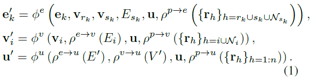
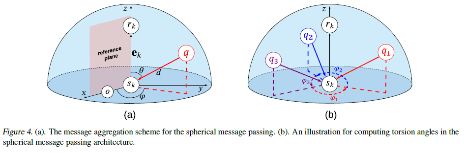
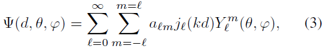
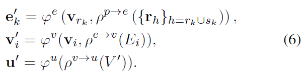
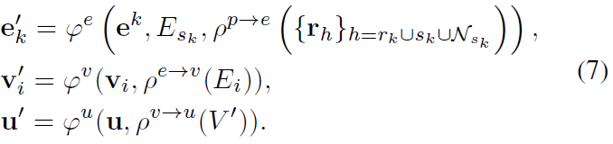
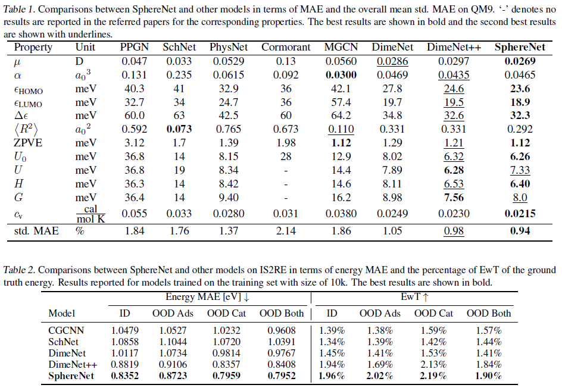
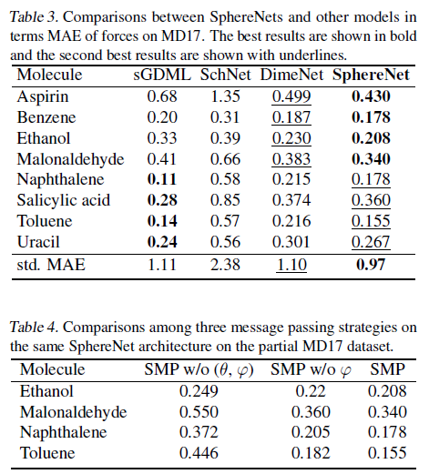

# 3줄 요약
1. molecule의 distance, angle, torsion 정보를 모두 활용
2. Spherical Coordinate System (SCS)에 적합한 Spherical Message Passing (SMP) 정의
3. Computation의 증가 없이 다양한 종류의 dataset에서 SOTA 달성
 

# Abstract
- 현재 3D의 공간적인 위치를 고려한 priciple한 GN 프레임워크가 부족하다.
- node들의 상대적인 위치가 SMS에서 unique하게 존재하고, SMP를 통하여 완전하고 정확한 3D Graph의 구조를 representation을 학습할 수 있다. 
- 기존의 3D model들은 모두 SphereNet의 한 종류들이라고 볼 수 있다.

 

 # 1. Introduction
 - 본 연구에서는 3D Grpah의 일반적인 framework로 3DGN (3D Graph Network)을 제안한다. 
 - 3DGN은 researcher들이 쉽게 3D Graph의 최신 method를 쉽게 개발할 수 있도록 다양한 수준의  세분화된 graph에서 명확한 인터페이스를 제공하는 것을 목표로 한다.
 - 원래의 3D Graph에서 Cartesian coordinate (데카르트 좌표)는 computational model에 대한 직접 입력으로 사용할 수 없다.
 - 모델의 성능을 손상시킬 수 있는 심각한 중복 정보가 포함되어 있기 때문
 - 또한 input graph의 translation과 rotation에 invariant 하지 않다.
 - 따라서 message passing neural network (MPNN)에 이어 3DGCN framework를 구현하기 위해 spherical message passing (SMP)으로 알려진 최신 message passing scheme을 제안한다.
 - spherical coordinate system (SCS)에서의 분석을 바탕으로, 3D graph의 각 node의 상대적인 위치가 SMP scheme에서 unique하게 결정된다는 것을 보여준다.
 - 제안하는 SMP는 SCS에서 3DGN을 구현하기 위한 완전하고 정확한 architecture를 표현한다.
 - encoding된 3D 정보는 pairwise node간의 거리와 같은 상대적인 위치 정보이므로, SMP는 input graph의 translation과 rotation에 invariant한 prediction을 한다.
 - 기존의 SchNet, DimeNet 등은 부분적인 3D 정보만 활용하기 때문에 모두 SphereNet의 한 종류이다.
  
 

# 2. Related Work
## 2.1 Graph Neural Networks
- GCN, GAT, GIN과 같은 기존의 일반적인 GNN은 3D positional info를 활용하지 않는다.

 

## 2.2 Methods for 3D Graphs
- translation, rotation에 invariant한 distance, angle, torsion을 반영해야한다.
- 이들은 모두 absolute Cartesian coordinates에 기반한 relative 3D info 들이다.
- 3D graph들의 methods는 아직 초기 단계이며, 기존의 연구들은 다른 종류의 3D info를 활용한다.
- SchNet은 aggregtaion 단계에서 continuous filter를 활용하여 distance 정보만을 반영한다.
- PhysNet은 interaction block에서 node feature와 distance 정보를 통합한다.
- DimeNet은 PhysNet 기반으로 개발되었고, interaction block에 angle 정보를 함께 고려한다.
- OrbNet은 SAAO feature를 input으로 사용하기 위해 distance 정보에 atomic orbital theory를 결합한다.

 

# 3. A Generic Framework for 3D Graphs
- 3D Graph는 4-tuple G = (u, V, E, P)로 나타낼 수 있다.
- u = grpah의 global feature vector
- V = node features의 set
- E = edges의 set
- 제안하는 3DGN framework는 식 1로 정의할 수 있다.
 

 

# 4. Spherical Message Passing Neural Networks
## 4.1 Spherical Message Passing
- SCS에서는 어느 점이든 3-tuple ($d$, $\theta$, $\varphi$) 로 특정할 수 있다.
- 각각 radial distance, polar angle, azimuthal angle을 의미하고, atom의 location으로 부터 쉽게 구할 수 있다.

- 그림에서 볼 수 있듯이, q의 location을 정확히 결정하기 위해서는 distance, angle, torsion 모두 필요하다.

 

## 4.2 Physical Solutions Approximating DFT
- 우리는 3-tuple ($d$, $\theta$, $\varphi$) 으로 graph 내의 node들의 상대적인 위치를 결정할 수 있다.
- 하지만 3-tuple ($d$, $\theta$, $\varphi$)이 의미있는 물리적인 표현을 나타내진 않기 때문에 직접적인 input으로 사용하진 않는다.
- quantum system에서, $\Psi$($d$, $\theta$, $\varphi$)은 DFT를 근사하는 슈뢰딩거 방정식의 해로 볼 수 있다.
- SCS에서 Schrödinger 방정식에 대한 일반적이고 규칙적인 해를 다음과 같이 나타낼 수 있다.

## 4.3 SphereNet
- SphereNet은 embedding block, interaction block, output block으로 구성된다.
- embedding block은 edge $k$의 initial message를 생성하고, 여기에 distance representation만 활용한다.
- interaction block은 모든 3개의 representation을 사용하여 edge $k$의 message를 update 한다.
- output block input으로 $k$에 대한 현재 message와 distance represention을 사용한다. 그리고 node $r_{k}$ 를 향하는 모든 message를 aggregate하여 node $r_{k}$의 feature vector를 얻는다.

 

# 5. Relation with Prior 3DGN Models
- SchNet

- DimeNet

 

# 6. Experimental Studies
- 3개의 benchmark dataset (QM9, OC20, MD17) 사용

- SOTA 달성 (Table 1,2,3)
- distance, angle, torsion 정보가 representation에 중요한 역할을 하였는지 알아보기 위해 ablation study 진행 (Table 4)

- SphereNet과 다른 모델들의 parameter 수와 소요 시간 비교
- DimeNet++과 차이가 거의 없는 것을 볼 수 있다.

 

# 7. Conclusion
- 3D Graph의 일반적이고 통합된 framework 제공
- 3DGN에 적합한 SMP architecture 개발
- Computation의 증가 없이 다양한 종류의 데이터셋에서 SOTA 달성
